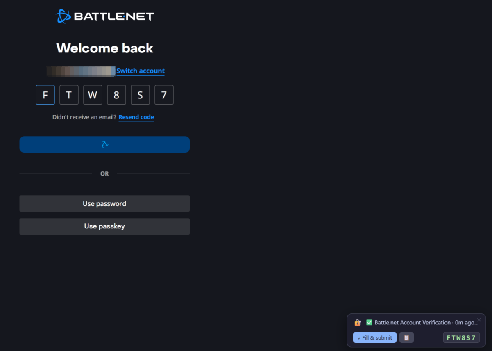
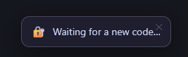
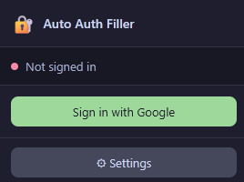
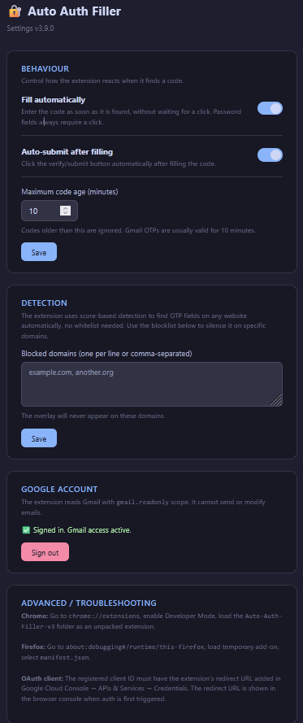

# Auto Auth Filler

Auto Auth Filler is a browser extension that finds the verification code in your
latest Gmail message and enters it into the one-time-code field on whatever page
you are using. You sign in with your Google account once, and after that it works
on every site with no per-site setup.

**[Watch it work (115 seconds)](https://youtu.be/S_3jNeLl1Iw)**

## Why it exists

Switching between your inbox and a login form to copy a six-digit code is a small
but constant annoyance, and it adds up if you use two-factor authentication
often. This extension removes that step. It recognises the input field, retrieves
the code from your inbox and fills it in without you leaving the page.

## Features

- Recognises one-time-code fields on effectively any website using a scoring
  system based on field attributes, input mode, label text and the wording of the
  surrounding form. There is no list of supported sites to maintain.
- Reads recent Gmail messages (read-only) and extracts the code with pattern
  matching that covers plain numeric codes, alphanumeric codes, hyphenated
  formats, Google's "G-XXXXXX" style and split single-digit boxes.
- Understands German forms as well as English ones.
- Enters the code as soon as it finds one and shows a small overlay naming the
  email it came from, with a copy button. Automatic filling can be switched off,
  and password fields always wait for a click.
- Optional auto-submit after filling, a configurable maximum code age and a
  per-domain blocklist.

## Browser support

| Browser | Status |
| --- | --- |
| Chrome 102 and newer | Full support |
| Edge 102 and newer | Full support |
| Brave, Opera, Vivaldi | Full support, Chromium based |
| Firefox 140 and newer | Full support |
| Firefox for Android 142 and newer | Declared, but untested |

Firefox 140 is the floor because that is the first version supporting the
`data_collection_permissions` manifest key that addons.mozilla.org requires.

## How it works

1. You sign in with Google once, granting the `gmail.readonly` scope. The
   extension cannot send, delete or modify your mail. It can only read it.
2. When you land on a page with a verification field, the content script
   recognises it and asks the background worker for a code.
3. The background worker searches your ten most recent Gmail messages from the
   last day, keeps only those newer than the maximum code age (ten minutes by
   default) and extracts the code from the first match. Plain text is preferred,
   and HTML-only mail has its tags stripped first.
4. The code is entered into the field, and the overlay shows which email it came
   from. If you have turned automatic filling off, the overlay waits for you to
   click instead.

No email content is stored or sent anywhere outside your browser. Message bodies
are held in memory only long enough to run the patterns over them, then
discarded.

## Installing from source

The extension is not yet in the browser add-on stores, so it loads as a
development add-on. You will need your own Google credentials first, described in
the next section.

### Chrome, Edge, Brave, Opera, Vivaldi

1. Open the browser's extensions page, for example `chrome://extensions`.
2. Turn on Developer mode.
3. Click **Load unpacked** and select this project's folder.
4. The extension icon appears in the toolbar.

### Firefox

1. Open `about:debugging#/runtime/this-firefox`.
2. Click **Load Temporary Add-on**.
3. Select `manifest.json` inside this folder.
4. The extension icon appears in the toolbar.

Firefox removes temporary add-ons on every restart. A permanent install needs the
extension signed through addons.mozilla.org.

## Setting up your own Google OAuth credentials

The extension needs its own Google Cloud project and OAuth client to reach the
Gmail API. The repository ships `config.template.js` but no working credentials,
so sign-in fails with a configuration error until you supply them.

1. Go to the Google Cloud Console and create or select a project.
2. Enable the Gmail API for it.
3. Create an OAuth 2.0 client of type **Web application**. Firefox requires this
   type, because `chrome.identity.getRedirectURL()` returns an HTTPS redirect URI
   and only a Web application client accepts one. The same client works for
   Chromium, so you need one client, not two.
4. Register the redirect URI each browser reports. Run
   `chrome.identity.getRedirectURL()` in the extension's console to see it. A
   client can hold several, so add them as you go rather than replacing them.
5. Copy the template and fill in your client ID and secret:

   ```
   copy config.template.js config.js      # Windows
   cp config.template.js config.js        # macOS and Linux
   ```

6. `config.js` is git-ignored, so your credentials stay out of the repository.
   Everything else, including `background.js`, is committed normally.

`config.template.js` has the full step-by-step version, including the consent
screen settings.

### A note on what is and is not secret

A **client ID** is not a credential. It ships inside every published extension
and anyone can read it by unpacking the XPI or CRX, and Google documents it as
public. It is kept out of the repository because it identifies a specific Google
Cloud project, not because leaking it would compromise anything.

The **client secret** is more awkward. Google's Web application client type
requires it at the token endpoint even when PKCE is used, which the token
endpoint confirms by answering `client_secret is missing` without it. Since
Firefox forces that client type, the secret has to ship inside the package too,
and anyone who unpacks the extension can read it.

That is why the authorization flow uses PKCE with SHA-256: an intercepted
authorization code cannot be redeemed without the verifier, which never leaves
the extension. Use a client dedicated to this extension, and never one shared
with a server-side application where the secret really does need protecting.

## First run

1. Click the extension icon in the toolbar.
2. Click **Sign in with Google** and approve the read-only Gmail permission.
3. Visit any site that emails you a verification code. When the extension finds a
   code field, it enters the code and the overlay shows where it came from.

You sign in once. The extension stores a refresh token and renews access
silently, so the consent screen does not come back.

## Settings

Open the settings page from the popup footer.

| Setting | Default | Description |
| --- | --- | --- |
| Fill automatically | On | Enters the code as soon as it is found. Password fields always wait for a click. |
| Auto-submit after filling | On | Activates the form's submit button once the field is filled. |
| Maximum code age | 10 minutes | Codes found in older emails are ignored. |
| Blocked domains | Empty | Domains, one per line, where the overlay never appears. |

## Privacy and permissions

The full policy is in [PRIVACY.md](PRIVACY.md), including the Google API Services
Limited Use disclosure. In summary:

- The only Gmail scope requested is `gmail.readonly`. The extension cannot send,
  delete or modify any email.
- The short-lived access token is kept in session storage and cleared when the
  browser closes. The refresh token is kept in local storage, because it has to
  survive a restart. That is what keeps you signed in instead of facing a consent
  screen every hour. Pressing **Sign out** deletes both and revokes the grant with
  Google.
- No data leaves your browser. There is no external server, no analytics and no
  telemetry.
- When a code is entered into a page, a short fingerprint of it is kept in local
  storage for ten minutes, so a code the site rejects is not entered again. The
  code itself is not stored and nothing is transmitted.
- Email bodies are processed in memory only, for as long as it takes to look for a
  code and are never written to disk or logged.

The content script runs on all sites because a verification field can appear on
any site. It inspects only form-field metadata: names, labels, input types,
maximum lengths and the surrounding form text. On a page where nothing scores
above the detection threshold it does nothing at all, and makes no network
request.

## Tests

The code extraction and OAuth logic are covered by a test suite that needs
nothing installed. From the project root, with Node 18 or newer:

```
node --test
```

It checks code extraction against a corpus of real email shapes, including the
German ones and the cases that used to fail. It also verifies the PKCE
implementation against the test vector in RFC 7636. If that last one ever fails,
the whole sign-in flow is wrong, so treat it as the canary.

Field detection is covered too. `content.js` is loaded against a DOM stub and
scored with plain objects exposing only what `scoreInput()` reads, which is
enough to test the scoring tiers, the German compounds and the card-PIN
demotion without a browser.

What is not covered is anything needing real layout or real event handling:
whether an element is visible, whether a site's own script fights the fill, and
the OAuth flow end to end. Those need a browser and a real account.

## Adding a language

English and German are supported. Every language-dependent word lives in
`vocabulary.js`, and adding one means editing that file and nothing else.

Language matters in four places, and the first is the one that catches people
out:

1. **The Gmail search query.** This is a gate, not a filter. A message the query
   does not match is never fetched, so no pattern further down can recover it.
2. **The labels that locate the code** inside the message.
3. **The words that identify a code field** on a web page.
4. **The text on the submit button**, used by auto-submit.

Entries are regular expression fragments rather than literal strings, so a term
can cover spelling variants. German shows why that matters: compounds like
`Bestätigungscode` have no word boundary before `code`, and the same word is
often written `bestaetigungscode` in form markup, so both spellings are listed.

For a language in a non-Latin script, read the note at the top of the file
first. JavaScript's `\b` is defined against `\w`, which is ASCII only, so every
Cyrillic or Greek letter counts as a non-word character and `\b` does not behave
the way it does in English. Those languages need Unicode property escapes and
the `u` flag.

## Building a release package

Run `package.bat` on Windows or `package.sh` on macOS and Linux from the project
root. Each script copies the extension files into `dist` and produces two ZIP
archives, one per store.

The two packages differ in one place. `manifest.json` carries both
`background.service_worker` and `background.scripts` so the folder loads unpacked
in either browser, but shipping both is not acceptable: Chrome warns that
`background.scripts` requires manifest version 2, and addons.mozilla.org warns
that `background.service_worker` is ignored. `make-manifest.js` strips the
irrelevant key for each target.

`config.js` is included in the package, since the extension cannot authenticate
without it, so make sure it holds your own credentials before uploading anything.

## Project structure

```
.
├── background.js        Background worker: OAuth, Gmail search, code extraction
├── config.js            Your credentials. Git-ignored; create it from the template
├── config.template.js   Template and instructions for your own OAuth client
├── content.js           Field detection, overlay, filling
├── vocabulary.js        Every language-dependent word, in one table
├── popup.html / .js     Toolbar popup
├── options.html / .js   Settings page
├── styles.css           Overlay styling, isolated from the host page
├── manifest.json        Manifest V3, with the gecko block for Firefox
├── make-manifest.js     Writes the per-browser manifest when packaging
├── package.bat / .sh    Packaging scripts for store submission
├── test/                Test suite, run with `node --test`
├── icons/               Toolbar and store icons
├── site/                The public website and privacy policy
├── PRIVACY.md           Privacy policy
└── CHANGELOG.md         Release history
```

## Screenshots

A code arriving and being entered, with the overlay naming the email it came
from and how long ago it was sent:



While the mail is still in flight, the overlay waits rather than reporting
failure:



The toolbar popup before signing in:



The settings page:



These are the same assets both stores ask for during submission, so capturing
them once covers the README and the listings.

## Contributing

Issues and pull requests are welcome. If you are changing how detection or
extraction works, please describe the kind of page or email format you tested
against. That logic is heuristic, and small adjustments have wide effects.

## License

MIT. See [LICENSE](LICENSE) for details.
